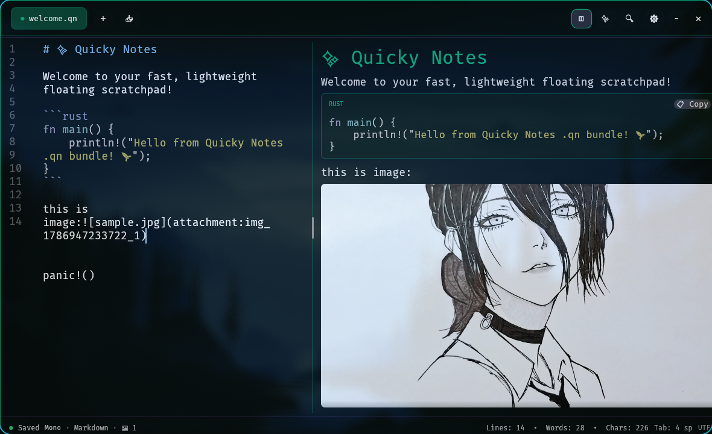
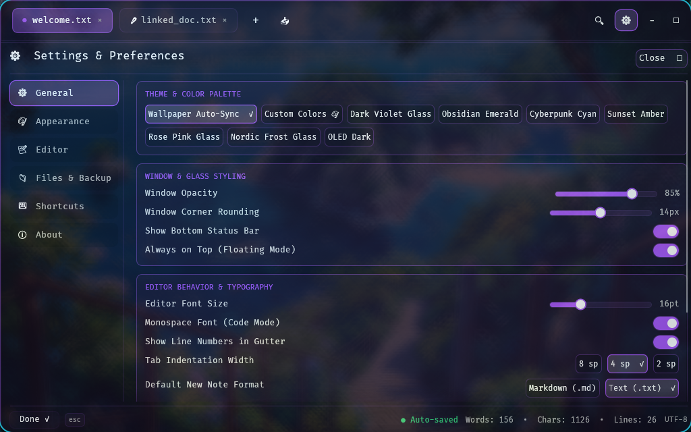

# quicky_notes

A lightweight floating glassmorphism note-taking widget for Hyprland and Wayland desktops.



## Features

- Wallpaper color auto-sync (Pywal and Caelestia)
- Native statistical autocomplete engine (Radix Trie and Markov n-gram model)
- Multi-provider AI Copilot (Gemini, OpenAI, Claude, DeepSeek, Groq, Ollama, OpenRouter)
- Real-time syntax highlighting for 15+ languages in edit and preview modes
- Portable .qn binary note bundles with embedded image attachments
- Clipboard image pasting and image preview gallery
- Direct disk file linking and interactive native export dialogs
- SQLite WAL storage with atomic JSON backups
- Fully customizable keybindings and visual theme settings



## Shortcuts

Default keybinding to open settings is `Ctrl + ,`. All keyboard shortcuts can be rebound and configured inside **Settings -> Shortcuts**.

## Installation

```bash
cargo install --path .
```

### Hyprland Configuration

```lua
-- Keybind
hl.bind("SUPER + N", hl.dsp.exec_cmd("quicky_notes"), { desc = "Toggle Quicky Notes" })

-- Window Rule
hl.rule({
    class = "quicky_notes",
    float = true,
    center = true,
    opacity = 0.85,
})
```

## Documentation

- [Suggestion Engine Architecture](docs/suggestion_engine_architecture.md)
- [Developer & AI Agent Guidelines](AGENTS.md)

## License

MIT
