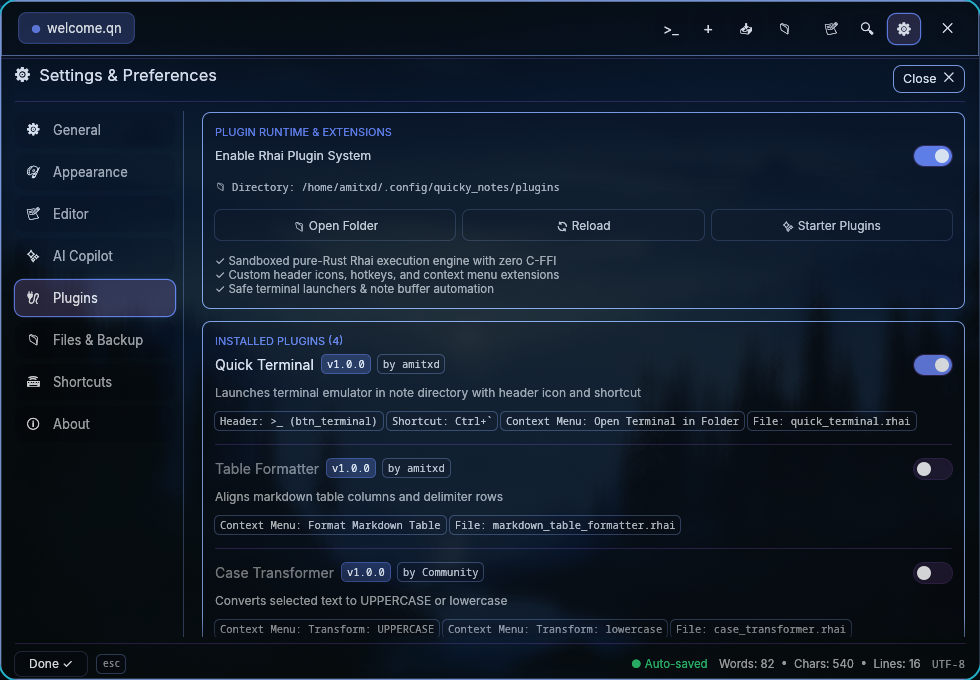

# Quicky Notes (WIP)

Lightweight floating glassmorphism note widget and fast code scratchpad for Hyprland, Wayland, and Linux desktops.


## Core Highlights

- Wallpaper color sync (Pywal & Caelestia) and adaptive glassmorphism
- Predictive autocomplete with local dual-engine ghost text
- Multi-provider AI Copilot (Gemini, Claude, OpenAI, Ollama, etc.)
- Portable `.qn` containers with embedded images and live disk sync
- Extensible Rhai scripting engine for plugins and custom actions




## Installation

```bash
# Using the installer script (binary, desktop entry, and icons)
./scripts/install.sh

# Or using Cargo
cargo install --path .
```

## CLI Usage

```bash
# Launch note widget
quicky

# Open specific files
quicky note.md main.rs document.qn

# Open folder workspace
quicky -f ~/projects/my_project

# Launch with folder sidebar open
quicky --sidebar ~/projects/my_project
```

## Shortcuts

| Shortcut | Action |
| :--- | :--- |
| `Ctrl + N` | New Note Tab |
| `Ctrl + W` | Close Active Tab |
| `Ctrl + S` | Save Notes / Linked Files |
| `Ctrl + O` | Open File Dialog |
| `Ctrl + Shift + O` | Open Folder Workspace Dialog |
| `Ctrl + F` | Search Notes |
| `Ctrl + ,` | Settings / Options |
| `Ctrl + M` | Cycle Markdown Mode (Edit / Split / Preview) |
| `Ctrl + Shift + F` | Toggle Folder Sidebar |
| `Ctrl + Space` | Open AI Copilot |
| `Tab` | Accept Ghost Autocomplete |

## Window Manager & Desktop Integration

### Hyprland (Lua)
```lua
-- ~/.config/hypr/hyprland.lua
hl.bind("SUPER + N", hl.dsp.exec_cmd("quicky"), { desc = "Toggle Quicky Notes" })
hl.rule({
    class = "quicky_notes",
    float = true,
    center = true,
    size = { 860, 600 },
})
```

## Documentation

- [Plugin Ecosystem & Developer Guide](docs/plugin_ecosystem.md)
- [Example Plugins (Rhai)](examples/)
- [Suggestion Engine Architecture](docs/suggestion_engine_architecture.md)

## License

MIT
